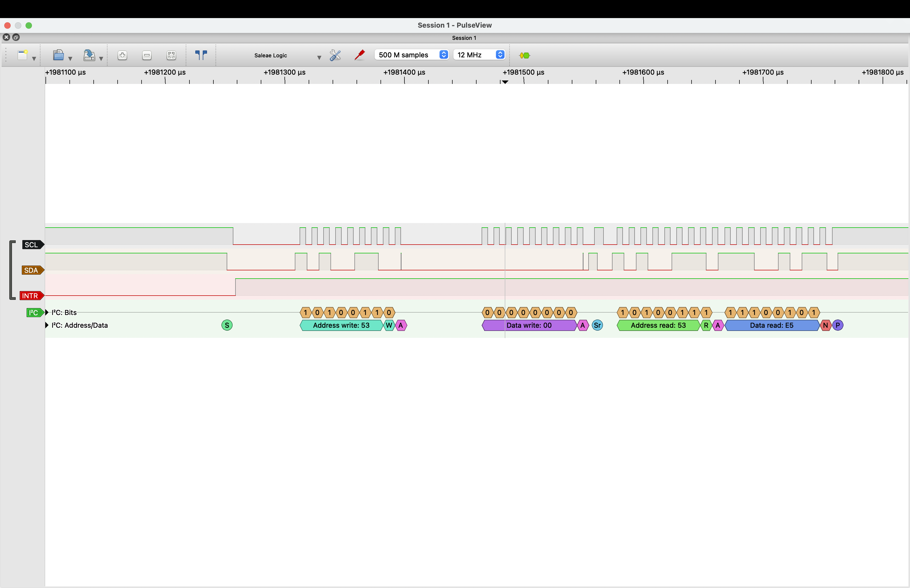
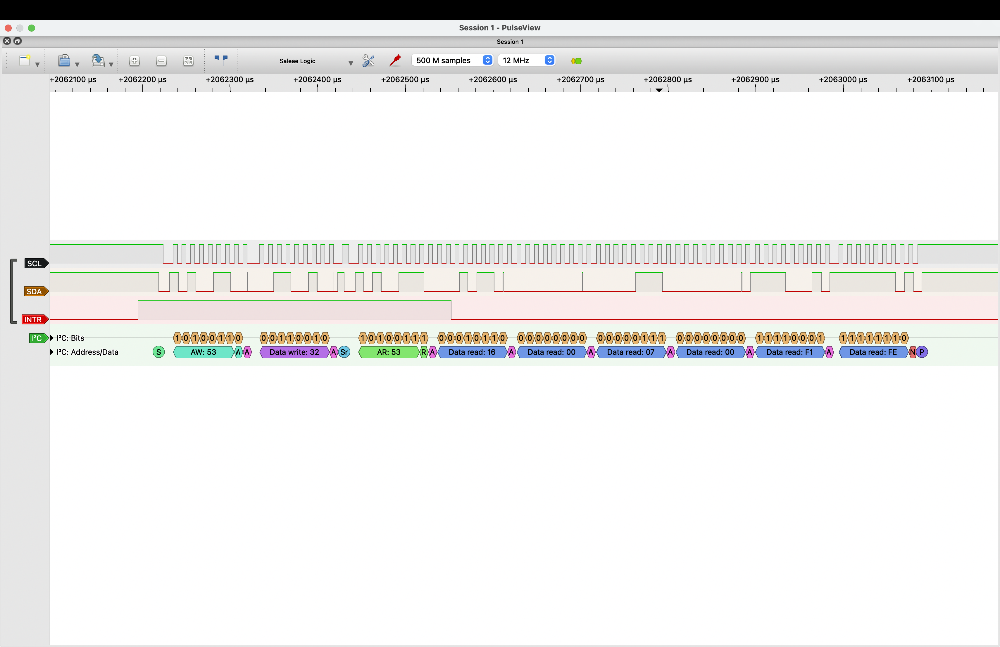
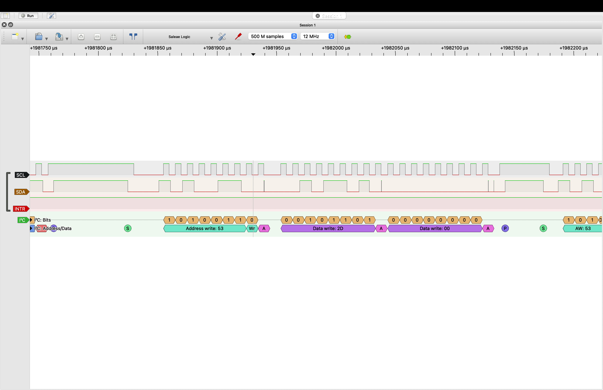

# STM32 Bare-Metal ADXL345 Driver

A bare-metal ADXL345 accelerometer driver for the STM32F103 written in C using register-level programming.

This project interfaces an STM32F103 microcontroller with the Analog Devices ADXL345 3-axis accelerometer over I²C. It implements a custom STM32F103 I²C driver together with a reusable ADXL345 device driver supporting sensor configuration, measurement control, raw and converted acceleration readings, and data-ready interrupt handling.

---

## Features

### STM32 I²C Driver

- Bare-metal I²C1 driver
- Register-level STM32F103 programming
- Single-byte register writes
- Single-byte register reads
- Multi-byte burst register reads
- Repeated START generation
- ACK/NACK handling
- Polling-based STM32 I²C state machine

### ADXL345 Driver

- Device ID verification
- Measurement range configuration
- Output data rate configuration
- Raw acceleration reads
- Acceleration conversion to `g`
- Start/Stop measurement
- Interrupt configuration
- Interrupt routing (INT1 / INT2)
- Register read-back verification
- Modular driver architecture

### Interrupt Support

- ADXL345 DATA_READY interrupt
- STM32 EXTI and NVIC configuration
- Interrupt-driven data acquisition

---

## Hardware Used

- STM32F103C8T6 Blue Pill
- ADXL345 accelerometer module
- ST-Link V2
- Breadboard and jumper wires

---

## Pin Connections

| STM32F103 | ADXL345 | Description |
|------------|----------|-------------|
| PB6 | SCL | I²C Clock |
| PB7 | SDA | I²C Data |
| PA0 | INT1 | Data Ready Interrupt |
| 3.3V | VCC | Power |
| GND | GND | Ground |
| 3.3V | CS | Select I²C Mode |
| GND | SDO | I²C Address = 0x53 |

---

## Project Structure

```text
.
├── app/
│   └── main.c
├── drivers/
│   ├── adxl345.c
│   └── i2c.c
├── include/
│   ├── adxl345.h
│   ├── i2c.h
│   └── stm32f103xx.h
├── linker/
│   └── main.ld
├── startup/
│   └── startup.c
├── Makefile
└── README.md
```

---

## Build

```bash
make
```

---

## Flash

```bash
make flash
```

---

## Clean

```bash
make clean
```

---

## Development tools

- arm-none-eabi-gcc
- gdb
- GNU Make
- st-util
- ST-Link V2

---

## Future Improvements

- ADXL345 FIFO support
- I²C timeout and error handling
- Activity/Tap detection

---

---

## Logic Analyzer Verification

The I²C driver was validated on real hardware using a 24 MHz USB logic analyzer.

### Single-byte register read

Verifies:

- START and repeated START generation
- Device addressing
- Register address transmission
- ACK/NACK sequencing
- Reading the ADXL345 `DEVID` register (`0xE5`)



---

### Multi-byte burst read

Verifies:

- Burst reads from consecutive registers
- ACK after intermediate bytes
- NACK on the final byte
- STOP generation after the final byte



---

### Single-byte register write

Verifies:

- Device and register addressing
- Register write transaction
- Data transmission
- ACK sequencing
- STOP generation



## References

- STM32F103 Reference Manual (RM0008)
- STM32F103 Datasheet
- Analog Devices ADXL345 Datasheet
