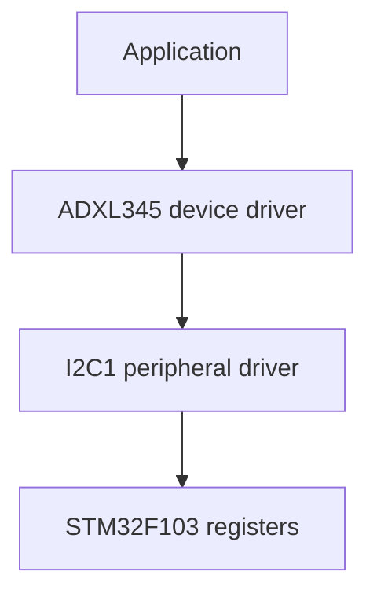

# STM32 Bare-Metal ADXL345 Driver

A bare-metal ADXL345 accelerometer driver for the STM32F103C8T6, written in C using register-level programming without STM32 HAL or LL dependencies.

The project interfaces an STM32F103 with an Analog Devices ADXL345 over I²C1. It supports sensor configuration and three-axis acceleration readings, with DATA_READY notification, polling-based I²C transfers, error reporting, transaction timeouts, and basic cleanup.

## Features

### STM32 I²C Driver

- Register-level I2C1 and GPIO initialization
- Standard-mode operation at 100 kHz with an 8 MHz peripheral clock
- Polling-based single-byte register reads and writes
- Multi-byte burst reads of three or more bytes
- START, repeated START, ACK/NACK sequencing, and STOP generation
- Bus error, arbitration loss, and NACK detection
- SysTick-based transaction timeouts and basic error cleanup
- Interrupt protection around critical receive sequences

### ADXL345 Driver

- Device ID and interrupt-source register reads
- Configurable measurement ranges: ±2 g, ±4 g, ±8 g, and ±16 g
- Full-resolution and fixed 10-bit modes
- Configurable output data rates up to 200 Hz with 100 kHz I²C
- Measurement, standby, sleep, and low-power mode configuration
- Six-byte XYZ burst reads with signed acceleration conversion to `g`
- Cached scale factor based on DATA_FORMAT register readback
- DATA_READY interrupt configuration on INT1

## Hardware

- STM32F103C8T6 Blue Pill development board
- ADXL345 accelerometer module
- ST-Link programmer/debugger
- Logic analyzer

## Connections

| STM32F103 / Supply | ADXL345 | Function |
|---|---|---|
| PB6 | SCL | I²C clock |
| PB7 | SDA | I²C data |
| PB0 | INT1 | DATA_READY interrupt |
| 3.3V | VCC | Power |
| GND | GND | Ground |
| 3.3V | CS | Select I²C mode |
| 3.3V | SDO / ALT ADDRESS | Select address `0x1D` |

SCL and SDA require pull-up resistors to 3.3V, which may already be present on the module. The driver uses the 7-bit address `0x1D` with SDO tied to 3.3V. Tying SDO to GND selects `0x53`; update the driver address accordingly.

## Hardware Setup

STM32F103C8T6 connected to the ADXL345 module, with ST-Link used for programming and debugging. The logic analyzer monitors SCL, SDA, and the sensor interrupt line.

## Driver Architecture


```mermaid
flowchart TD
    A[Application] --> B[ADXL345 device driver]
    B --> C[I2C1 peripheral driver]
    C --> D[STM32F103 registers]
```

The I²C layer handles peripheral configuration, register transactions, timeouts, and basic error cleanup.

The ADXL345 layer implements sensor configuration, register access, and acceleration conversion on top of the I²C driver.

EXTI provides DATA_READY notification, while SysTick provides the millisecond timebase used by the I²C driver.

## Public Driver API

```c
adxl345_status_t adxl345_read_device_id_register(uint8_t *device_id);

adxl345_status_t adxl345_set_data_format_register(uint8_t data_format);
adxl345_status_t adxl345_set_bandwidth_rate_register(uint8_t bandwidth_rate);
adxl345_status_t adxl345_set_power_control_register(uint8_t power_control);

adxl345_status_t adxl345_read_acceleration(acceleration_t *acceleration);

adxl345_status_t adxl345_setup_interrupt(
    uint8_t interrupt_enable,
    uint8_t interrupt_map,
    adxl345_interrupt_callback_t callback);

adxl345_status_t adxl345_read_interrupt_source_register(
    uint8_t *interrupt_source);
```

The public sensor APIs use a blocking design and propagate I²C failures through `adxl345_status_t`. Acceleration is returned as floating-point X, Y, and Z values in `g`.

## Acceleration Reading

Each acceleration read:

1. Writes the starting register address, DATAX0 (`0x32`).
2. Generates a repeated START and addresses the sensor for reading.
3. Reads six consecutive bytes for X, Y, and Z.
4. ACKs intermediate bytes and NACKs the final byte before ending the transfer with STOP.
5. Combines each byte pair into a signed value and applies the cached scale factor.

The driver expects right-aligned sensor output. The example configures full resolution, a ±2 g range, and a 200 Hz output data rate.

## DATA_READY Handling

The sensor's INT1 output connects to PB0, mapped to EXTI0.

The EXTI callback sets a `volatile` data-ready flag. The main loop clears the flag before reading the sensor and increments `samples_captured` after a successful read.

The interrupt handler only signals that data is ready. The main loop performs the polling-based I²C read, allowing SysTick interrupts to maintain the timeout timebase.

## Error Handling

Each transaction uses a shared 10 ms timeout across its polling waits. While waiting for transfer events, the driver checks for bus errors, arbitration loss, and NACKs.

On failure, basic cleanup requests STOP where applicable and uses a separate 10 ms wait budget. It avoids requesting STOP when arbitration loss is detected, clears handled error flags, and reports `RECOVERY_FAILED` if the STOP wait times out.

Cleanup is best effort; it does not guarantee recovery from every receive-stage timeout or a physically stuck bus.

## Verification

Device ID and acceleration values can be inspected in GDB through `device_id` and `acceleration`. The expected device ID is `0xE5`; the application reads it but does not enforce a value comparison.

DATA_FORMAT is read back to determine the conversion scale. This is not general configuration verification: the returned register value is not compared with the requested value.

The address-NACK cleanup path was tested by using an incorrect address, then successfully reading with the correct address without resetting the MCU.

## Logic Analyzer Validation

The [`debugging/logic-analyzer/`](debugging/logic-analyzer/) directory contains transaction captures covering:

- Single-byte register write
- Single-byte register read
- Six-byte acceleration burst read

An additional DATA_READY capture measures the interval between consecutive interrupt rising edges.

| Measurement | Observed result |
|---|---|
| Single-byte write, START to STOP | 336 µs |
| Single-byte read, START to STOP | 460 µs |
| Six-byte burst read, START to STOP | 1.012 ms |
| DATA_READY interval at configured 200 Hz | Approximately 5.1 ms |

The captures show addressing, ACK/NACK sequencing, repeated START, and STOP generation. They were sampled at 12 MHz with I²C configured for 100 kHz. These measurements describe the captured transactions, not worst-case timing guarantees.

## Project Structure

```text
stm32-bare-metal-adxl345-driver/
├── build/
├── debugging/
├── include/
│   ├── adxl345.h
│   ├── adxl345_internal.h
│   ├── cortex_m3.h
│   ├── exti.h
│   ├── exti_internal.h
│   ├── i2c.h
│   ├── stm32f103xx.h
│   ├── systick.h
│   └── systick_internal.h
├── linker/
│   └── main.ld
├── src/
│   ├── adxl345.c
│   ├── exti.c
│   ├── i2c.c
│   ├── main.c
│   └── systick.c
├── startup/
│   └── startup.c
├── Makefile
└── README.md
```

## Building

Build the firmware with:

```bash
make
```

Flash and clean using:

```bash
make flash
make clean
```

The configuration assumes an 8 MHz core/peripheral clock. The tested board reports 20 KiB SRAM and 128 KiB flash through ST-Link; the linker script uses the reported flash capacity.

## Development & Debugging Tools

- `arm-none-eabi-gcc`
- GNU Make
- GDB
- ST-Link and `st-util`
- Saleae Logic

## Limitations

- I²C transfers are blocking and polling-based; DMA and interrupt-driven transfers are not implemented.
- The driver supports a single caller at a time and is not reentrant.
- Error recovery is basic; peripheral reset and GPIO bus recovery are not implemented.

## What This Project Demonstrates

- Bare-metal STM32F103 I²C programming
- Device-driver layering and sensor register configuration
- Repeated START, burst reads, and timing-sensitive receive sequences
- Signed sensor-data conversion and cached scaling
- Short interrupt handlers with main-loop data acquisition
- Error propagation, transaction timeouts, and basic cleanup
- Logic analyzer protocol and timing validation

## References

- STM32F103 reference manual (RM0008)
- [STM32F103x8/xB datasheet](https://www.st.com/resource/en/datasheet/stm32f103c8.pdf)
- [ADXL345 datasheet](https://www.analog.com/media/en/technical-documentation/data-sheets/adxl345.pdf)
- STM32F10xxx I²C optimized examples (AN2824)
